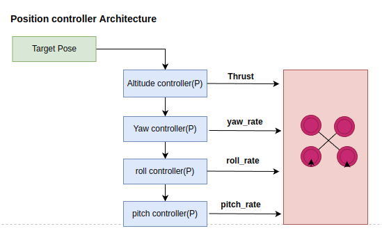
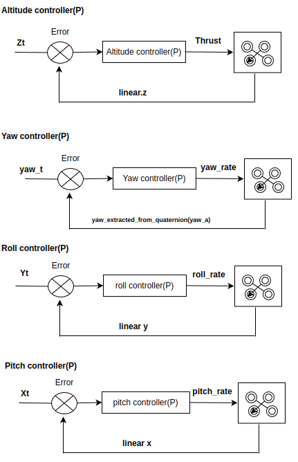

This package carries the tii assignment development code. The developed control algorithm having dependencies with various ros message formats such as std_msgs, geometry_msgs, mavros_msgs, tf & tf2. I have considered all these message format dependencies while creating pacakge.

The designed position control algorithm uses a "Manual Joystick overriding concept." As per your problem statement, the control algorithm has to share thrust and bodyrates with the drone and has to effectively control the drone's desired positions. To implement this approach, the very first idea that came to my mind was the Udacity 3D PID controller. However, in order to simulate the Udacity control algorithm, I must assume a number of parameters, such as the drone's mass and the maximum propeller angular rates, process gains, and so on. These parameters are hard to assume and implement in 3D control algorithms as well as test with simulation in a minimum amount of time.
Then I analysed the drone dynamics model equations and udacity 3D control architecture. I realised if I got some thrust and bodyrates from some other source, I could design my own control system to control the pose of the drone.
After doing some research and trial and error with mavros topics, I got to know about the "Manual Joystick Overriding Concept." In real-time, we will use a joystick to control drone movement and each control button will be associated with thrust and bodyrate vectors. The same approach is available as a mavros topic "/mavros/manual_control/send". I have tried to publish some data on this topic and after doing a lot of trial and error, I figured out the minimum thrust and bodyrates values required to move a drone using this topic.
Based on those minimum thrust and bodyrate values, I have designed a simple 3D position control algorithm. This algorithm carries four individual control blocks like the Altitude Controller, Yaw Controller, Roll Controller, and Pitch Controller. All of these control blocks implement the proportional controller concept.
The work flow of the implemented position controller follows.
1. The altitude controller runs first and corrects the target z value with the actual simulated drone z value.
2. As a second, the yaw controller enables and corrects to the desired yaw angle.
3. Later pitch and roll controllers correct their errors in the pitch and roll axis respectively.

Note: All these controllers run sequentially one after another based on previous controller feedback and correct respective axis errors one by one.

The designed 3D position controller architectural flow diagram.

The detailed individual control blocks architectural flow diagrams.

### Build Instructions
> mkdir -p drone_ws/src\
> cd drone_ws/src\
> git clone https://github.com/darshan186/assignment1 \
> cd ..\
> catkin build

Note: I hope docker image is alreday installed in your current system.
### Start a docker simulation for the iris platform using PX4 environment & mavros 
> cd ~drone_ws/src/assignment1 \
> sudo ./start_gazebo_host.sh

### Running rqt_plot to show/generate stability graph.
> cd ~drone_ws\
> souce devel/setup.bash\
> rosrun rqt_plot rqt_plot /mavros/local_position/pose/pose/position/x /mavros/local_position/pose/pose/position/y /mavros/local_position/pose/pose/position/z

### Running assignement development code
> cd ~drone_ws\
> souce devel/setup.bash\
> rosrun tii_pkg position_controller

## (OR)
### Use launch file to run both rqt_plot and assignment code at same time.
> cd ~drone_ws\
> souce devel/setup.bash\
> roslaunch tii_pkg testing_new.launch

